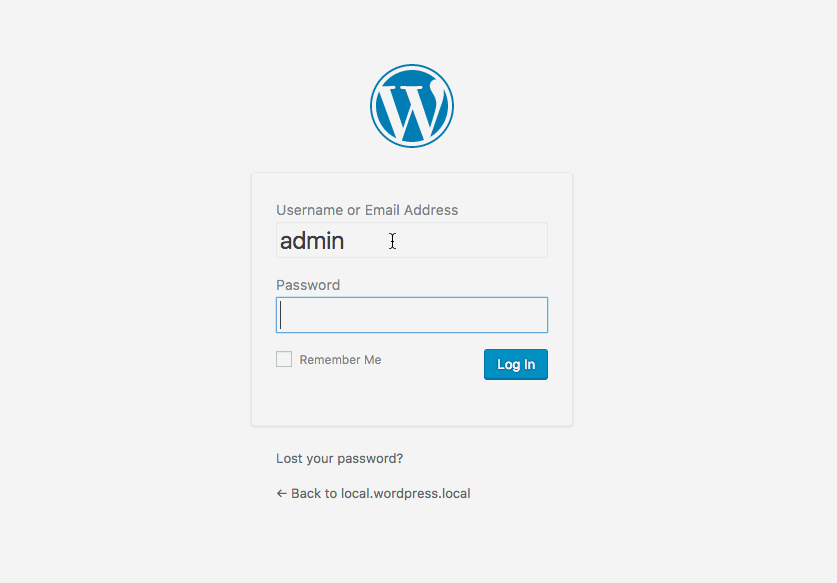

# Two Fa

Demo/Lazy Plugin. Do not use in production.

---

Implements a placeholder version of two-factor-authentication.

1. User logs in with normal username and password
2. If authenticated, WP adds a pre-auth code and expiration time to the user (in meta)
3. A cookie is created with user's ID and pre-auth code
4. Instead of signing the user in, they are redirected to another login screen for verification.
5. User enters code
6. WP checks for cookie, compares cookie to database, and checks 2fa code.

In this plugin, the 2fa code is hard-coded value. You can swap out the logic for what ever you want. Or just steal relevant parts of the code for your own use. You do you.

